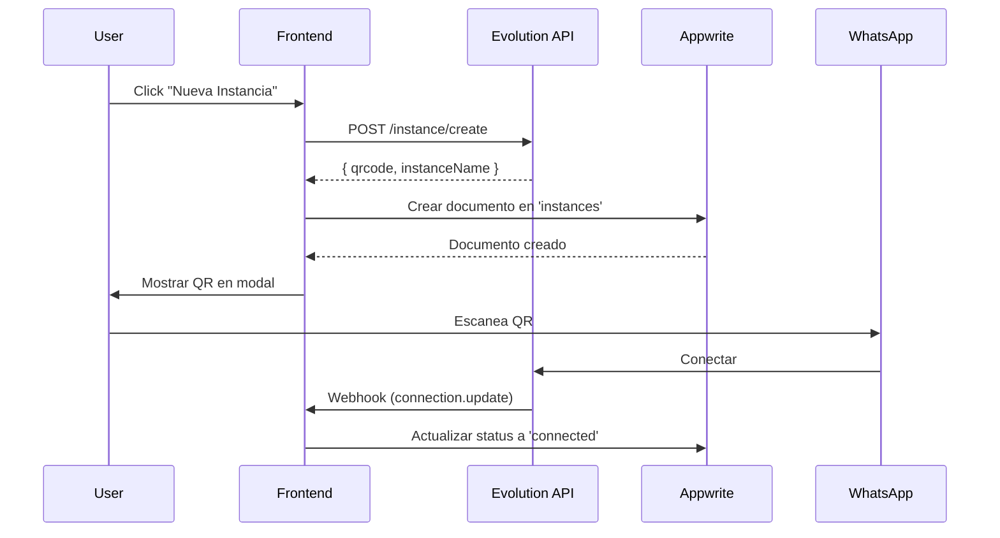
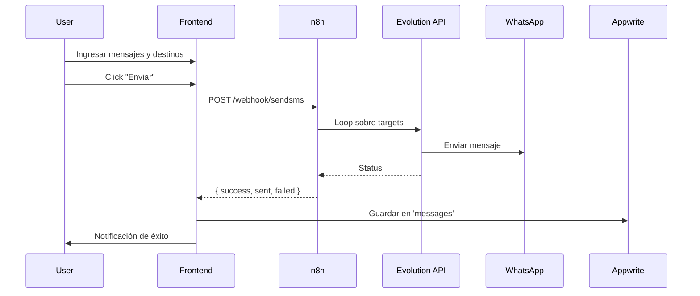
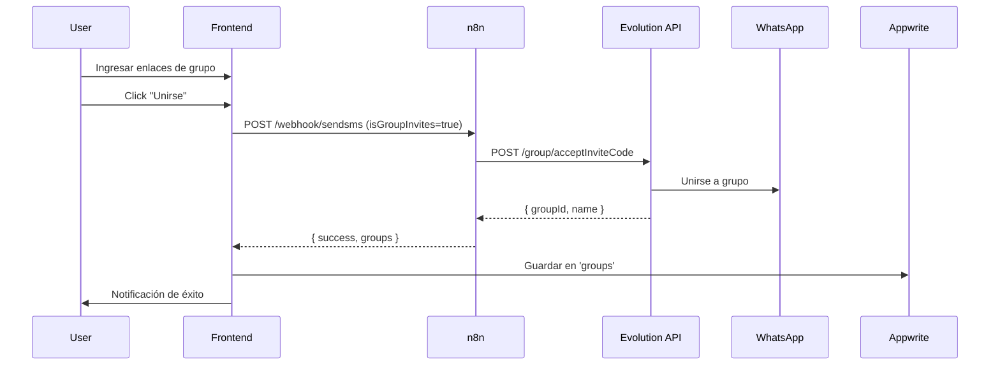

# Endpoints y Webhooks

Documentación completa de todos los endpoints de Evolution API, webhooks de n8n y APIs de Appwrite utilizados en este proyecto.

## Tabla de Contenidos

- [n8n Webhooks](#n8n-webhooks)
- [Evolution API](#evolution-api)
- [Appwrite Collections](#appwrite-collections)

---

## n8n Webhooks

### Webhook Principal: `/webhook/sendsms`

**URL Base**: `http://localhost:5678` (desarrollo) o tu dominio en producción

**Endpoint**: `/webhook/sendsms`

**Método**: `POST`

**Content-Type**: `application/json`

### Caso 1: Enviar Mensajes

Envía mensajes de texto a números individuales o grupos.

**Request Body**:

```json
{
  "instance": "mi-whatsapp-1",
  "messages": [
    "¡Hola! ¿Cómo estás?",
    "Hola, espero que estés bien",
    "¿Qué tal todo?"
  ],
  "targets": [
    "+5491123456789",
    "+5491198765432"
  ],
  "isGroup": false,
  "delayMin": 5,
  "delayMax": 10
}
```

**Parámetros**:

| Campo | Tipo | Requerido | Descripción |
|-------|------|-----------|-------------|
| instance | string | Sí | Nombre de la instancia de Evolution API |
| messages | string[] | Sí | Array de mensajes (se elige uno al azar) |
| targets | string[] | Sí | Array de números o IDs de grupo |
| isGroup | boolean | Sí | `true` para grupos, `false` para números |
| delayMin | number | No | Delay mínimo en segundos (default: 5) |
| delayMax | number | No | Delay máximo en segundos (default: 10) |

**Response Exitoso**:

```json
{
  "success": true,
  "sent": 2,
  "failed": 0,
  "details": [
    {
      "target": "+5491123456789",
      "status": "sent",
      "message": "¡Hola! ¿Cómo estás?"
    },
    {
      "target": "+5491198765432",
      "status": "sent",
      "message": "Hola, espero que estés bien"
    }
  ]
}
```

**Response Error**:

```json
{
  "success": false,
  "error": "Instance not connected",
  "code": "INSTANCE_DISCONNECTED"
}
```

### Caso 2: Unirse a Grupos

Une la instancia a uno o más grupos de WhatsApp.

**Request Body**:

```json
{
  "instance": "mi-whatsapp-1",
  "inviteCodes": [
    "https://chat.whatsapp.com/ABC123XYZ",
    "https://chat.whatsapp.com/DEF456UVW"
  ],
  "isGroupInvites": true
}
```

**Parámetros**:

| Campo | Tipo | Requerido | Descripción |
|-------|------|-----------|-------------|
| instance | string | Sí | Nombre de la instancia |
| inviteCodes | string[] | Sí | Array de enlaces de invitación |
| isGroupInvites | boolean | Sí | Debe ser `true` |

**Response Exitoso**:

```json
{
  "success": true,
  "joined": 2,
  "failed": 0,
  "groups": [
    {
      "inviteCode": "ABC123XYZ",
      "groupId": "123456789@g.us",
      "name": "Grupo de Prueba",
      "status": "joined"
    },
    {
      "inviteCode": "DEF456UVW",
      "groupId": "987654321@g.us",
      "name": "Otro Grupo",
      "status": "joined"
    }
  ]
}
```

**Códigos de Error Comunes**:

| Código | Descripción |
|--------|-------------|
| INSTANCE_NOT_FOUND | La instancia no existe |
| INSTANCE_DISCONNECTED | La instancia está desconectada |
| INVALID_INVITE_CODE | El código de invitación es inválido |
| GROUP_FULL | El grupo está lleno |
| ALREADY_MEMBER | Ya eres miembro del grupo |

---

## Evolution API

**URL Base**: `http://localhost:8080` (desarrollo) o tu dominio en producción

**Authentication**: API Key en header `apikey: B6D711FCDE4D4FD5936544120E713976`

### Gestión de Instancias

#### 1. Crear Instancia

Crea una nueva instancia de WhatsApp.

**Endpoint**: `POST /instance/create`

**Headers**:
```
apikey: B6D711FCDE4D4FD5936544120E713976
Content-Type: application/json
```

**Body**:
```json
{
  "instanceName": "mi-whatsapp-1",
  "qrcode": true
}
```

**Response**:
```json
{
  "instance": {
    "instanceName": "mi-whatsapp-1",
    "status": "created"
  },
  "hash": {
    "apikey": "..."
  },
  "qrcode": {
    "code": "2@...",
    "base64": "data:image/png;base64,..."
  }
}
```

#### 2. Obtener Código QR

Obtiene el código QR para conectar una instancia.

**Endpoint**: `GET /instance/connect/{instanceName}`

**Headers**:
```
apikey: B6D711FCDE4D4FD5936544120E713976
```

**Response**:
```json
{
  "code": "2@...",
  "base64": "data:image/png;base64,..."
}
```

**Nota**: El QR caduca en ~60 segundos. Llamar nuevamente para obtener uno fresco.

#### 3. Estado de Conexión

Verifica el estado de conexión de una instancia.

**Endpoint**: `GET /instance/connectionState/{instanceName}`

**Headers**:
```
apikey: B6D711FCDE4D4FD5936544120E713976
```

**Response**:
```json
{
  "instance": "mi-whatsapp-1",
  "state": "open"
}
```

**Estados posibles**:
- `open`: Conectada
- `close`: Desconectada
- `connecting`: Conectando

#### 4. Eliminar Instancia

Elimina una instancia y todos sus datos.

**Endpoint**: `DELETE /instance/delete/{instanceName}`

**Headers**:
```
apikey: B6D711FCDE4D4FD5936544120E713976
```

**Response**:
```json
{
  "status": "success",
  "message": "Instance deleted"
}
```

#### 5. Listar Instancias

Lista todas las instancias creadas.

**Endpoint**: `GET /instance/fetchInstances`

**Headers**:
```
apikey: B6D711FCDE4D4FD5936544120E713976
```

**Response**:
```json
[
  {
    "instanceName": "mi-whatsapp-1",
    "status": "open",
    "profilePicUrl": "...",
    "phoneNumber": "5491123456789"
  },
  {
    "instanceName": "mi-whatsapp-2",
    "status": "close"
  }
]
```

### Envío de Mensajes

#### 6. Enviar Mensaje de Texto

**Endpoint**: `POST /message/sendText/{instanceName}`

**Headers**:
```
apikey: B6D711FCDE4D4FD5936544120E713976
Content-Type: application/json
```

**Body para número individual**:
```json
{
  "number": "5491123456789",
  "text": "Hola, ¿cómo estás?"
}
```

**Body para grupo**:
```json
{
  "number": "123456789-1234567890@g.us",
  "text": "Hola grupo!"
}
```

**Response**:
```json
{
  "key": {
    "remoteJid": "5491123456789@s.whatsapp.net",
    "id": "3EB0..."
  },
  "message": {
    "conversation": "Hola, ¿cómo estás?"
  },
  "messageTimestamp": "1234567890",
  "status": "PENDING"
}
```

### Gestión de Grupos

#### 7. Obtener Participantes de Grupo

**Endpoint**: `GET /group/participants/{instanceName}`

**Headers**:
```
apikey: B6D711FCDE4D4FD5936544120E713976
```

**Query Params**:
- `groupJid`: ID del grupo (ej: `123456789@g.us`)

**Response**:
```json
{
  "participants": [
    {
      "id": "5491123456789@s.whatsapp.net",
      "admin": "admin"
    },
    {
      "id": "5491198765432@s.whatsapp.net",
      "admin": null
    }
  ]
}
```

#### 8. Unirse a Grupo por Código de Invitación

**Endpoint**: `POST /group/acceptInviteCode/{instanceName}`

**Headers**:
```
apikey: B6D711FCDE4D4FD5936544120E713976
Content-Type: application/json
```

**Body**:
```json
{
  "inviteCode": "ABC123XYZ"
}
```

**Response**:
```json
{
  "groupId": "123456789@g.us"
}
```

#### 9. Obtener Información de Grupo

**Endpoint**: `GET /group/findGroupInfo/{instanceName}`

**Headers**:
```
apikey: B6D711FCDE4D4FD5936544120E713976
```

**Query Params**:
- `groupJid`: ID del grupo

**Response**:
```json
{
  "id": "123456789@g.us",
  "subject": "Nombre del Grupo",
  "creation": 1234567890,
  "owner": "5491123456789@s.whatsapp.net",
  "desc": "Descripción del grupo",
  "participants": [...]
}
```

### Webhooks de Evolution API

Evolution API puede enviar webhooks cuando ocurren eventos. Configurar en la creación de la instancia o en settings.

**Eventos disponibles**:
- `messages.upsert`: Nuevo mensaje recibido
- `messages.update`: Mensaje actualizado (leído, entregado)
- `connection.update`: Cambio en el estado de conexión
- `groups.upsert`: Nuevo grupo
- `groups.update`: Actualización de grupo

---

## Appwrite Collections

### Collections IDs

Definidos en `/frontend/src/providers/appwrite.ts`:

```typescript
export const COLLECTIONS = {
  INSTANCES: 'instances',
  GROUPS: 'groups',
  MESSAGES: 'messages',
  SYSTEM_LOGS: 'system_logs',
  USER_FEEDBACK: 'user_feedback',
};
```

### Operaciones CRUD

Appwrite usa su propio SDK, pero Refine abstrae las operaciones:

#### Listar Documentos

```typescript
const { data } = useList({
  resource: 'instances',
  filters: [
    { field: 'status', operator: 'eq', value: 'connected' }
  ],
  sorters: [
    { field: 'createdAt', order: 'desc' }
  ],
  pagination: { current: 1, pageSize: 10 }
});
```

**Traducción a Appwrite SDK**:
```typescript
databases.listDocuments(
  DATABASE_ID,
  'instances',
  [
    Query.equal('status', 'connected'),
    Query.orderDesc('createdAt'),
    Query.limit(10)
  ]
);
```

#### Crear Documento

```typescript
const { mutate: createInstance } = useCreate();

createInstance({
  resource: 'instances',
  values: {
    name: 'mi-whatsapp',
    status: 'qr_needed',
    userId: currentUserId,
    createdAt: new Date().toISOString(),
    updatedAt: new Date().toISOString()
  }
});
```

#### Actualizar Documento

```typescript
const { mutate: updateInstance } = useUpdate();

updateInstance({
  resource: 'instances',
  id: instanceId,
  values: {
    status: 'connected',
    phoneNumber: '+5491123456789',
    updatedAt: new Date().toISOString()
  }
});
```

#### Eliminar Documento

```typescript
const { mutate: deleteInstance } = useDelete();

deleteInstance({
  resource: 'instances',
  id: instanceId
});
```

### Realtime Subscriptions

Appwrite soporta subscriptions en tiempo real:

```typescript
import { client } from './providers/appwrite';

const unsubscribe = client.subscribe(
  `databases.${DATABASE_ID}.collections.instances.documents`,
  (response) => {
    console.log('Cambio detectado:', response);

    if (response.events.includes('databases.*.collections.*.documents.*.create')) {
      console.log('Nueva instancia creada');
    }
  }
);

// Cleanup
return () => unsubscribe();
```

**Eventos disponibles**:
- `databases.*.collections.*.documents.*.create`
- `databases.*.collections.*.documents.*.update`
- `databases.*.collections.*.documents.*.delete`

### Autenticación

#### Login

```typescript
import { account } from './providers/appwrite';

const session = await account.createEmailSession(
  'user@example.com',
  'password123'
);
```

#### Logout

```typescript
await account.deleteSession('current');
```

#### Get Current User

```typescript
const user = await account.get();
console.log(user.$id, user.email, user.name);
```

---

## Flujos Completos

### Flujo 1: Crear y Conectar Instancia



### Flujo 2: Enviar Mensajes



### Flujo 3: Unirse a Grupo



---

## Rate Limits y Mejores Prácticas

### Evolution API

- **Mensajes por minuto**: Recomendado máximo 60 (varía según WhatsApp)
- **QR Code refresh**: Máximo cada 5 segundos
- **Timeout**: 30 segundos para operaciones

### n8n

- **Webhook timeout**: 300 segundos (configurable)
- **Concurrent executions**: Depende de tu instalación

### Appwrite

- **Requests por minuto**: 60 (gratis), ilimitado (pro)
- **Document size**: 1MB máximo
- **Realtime connections**: 100 simultáneas (gratis)

### WhatsApp

- **Recomendaciones**:
  - Intervalo mínimo entre mensajes: 5 segundos
  - Máximo 256 caracteres por mensaje para mejor compatibilidad
  - No más de 100 mensajes por hora desde una cuenta nueva
  - Variar el texto para evitar detección de spam

---

## Códigos de Error

### Evolution API

| Código | Descripción | Solución |
|--------|-------------|----------|
| 400 | Bad Request | Verificar payload |
| 401 | Unauthorized | Verificar API key |
| 404 | Instance not found | Crear la instancia primero |
| 500 | Server Error | Revisar logs de Evolution API |

### n8n

| Código | Descripción | Solución |
|--------|-------------|----------|
| 404 | Webhook not found | Verificar URL y activar workflow |
| 500 | Workflow Error | Revisar ejecución en n8n UI |
| 504 | Timeout | Aumentar timeout o reducir carga |

### Appwrite

| Código | Descripción | Solución |
|--------|-------------|----------|
| 401 | Unauthorized | Verificar sesión |
| 404 | Document not found | Verificar ID |
| 409 | Conflict | Documento duplicado (unique field) |

---

**Última actualización**: 2025-10-21
